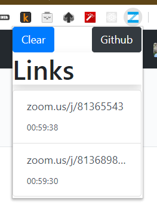

# Zoom.us Link History
You can find your previous meeting links

Use case: If you use a meeting link more than one, you should find the link everytime. Via this extension, you can find easily it.

Download from https://github.com/emindeniz99/zoom-link-history/releases/download/0.1/zoomLinkHistory.crx 
and install to chromium based browser

